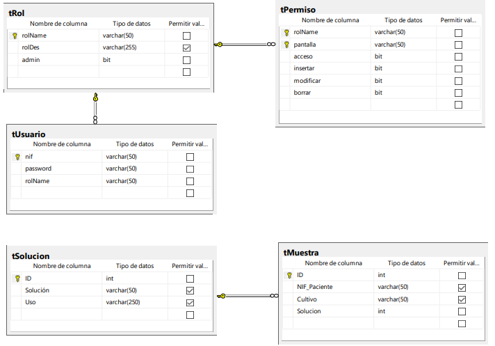
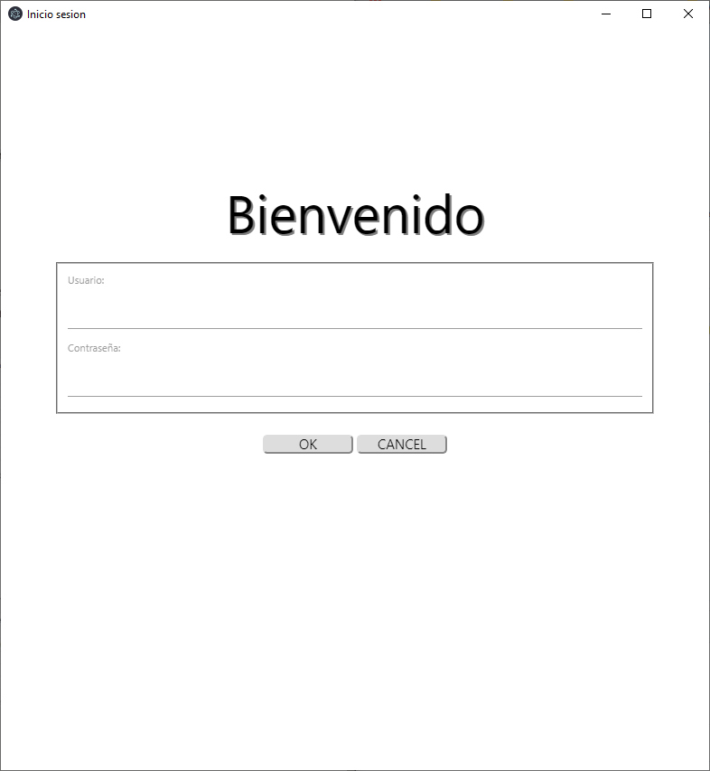
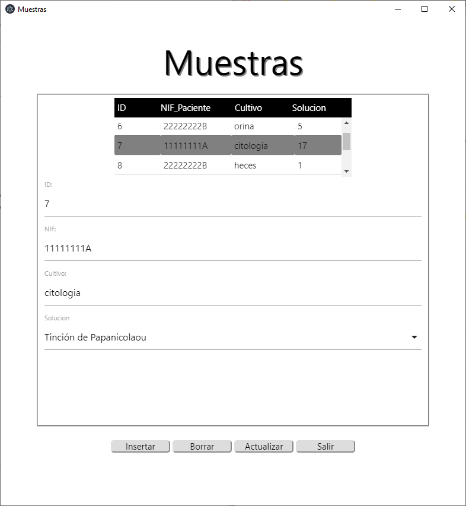

# Electron + MariaDB

#### Run it

You can find the app release in: https://github.com/VictoriaUMA/gestionInformacion/releases
As the app is using a database inside a Raspberry Pi, we cannot ensure we will maintain it. In order to run the app without this database you can build the app yourself:

`git clone https://github.com/VictoriaUMA/gestionInformacion.git `
`cd electron-project`
`npm install`
`npm electron .`
`npm start`

To  put your own database you must modify: `~/electron-project/js/BD.js` you have an script of the database `~/practica.sql`

#### Description

This applications is for the maintenance of a database of chemical solutions used in different biological crops. The database schema is as follows:

And this is the app itself:

